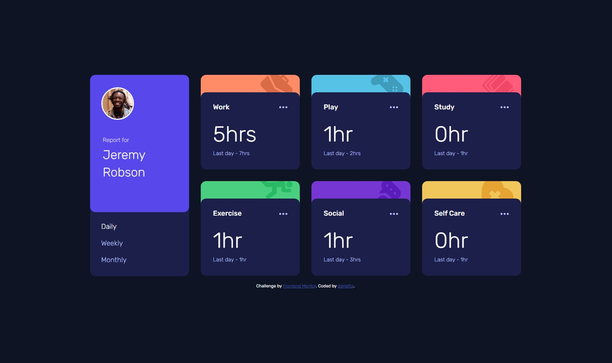

# Frontend Mentor - Time tracking dashboard solution

This is my solution to the [Time tracking dashboard challenge on Frontend Mentor](https://www.frontendmentor.io/challenges/time-tracking-dashboard-UIQ7167Jw).

## Table of contents

- [Overview](#overview)
  - [The challenge](#the-challenge)
  - [Screenshot](#screenshot)
  - [Links](#links)
- [My process](#my-process)
  - [Built with](#built-with)
  - [What I learned](#what-i-learned)
  - [Continued development](#continued-development)
  - [Useful resources](#useful-resources)
- [Author](#author)

## Overview

### The challenge

Users should be able to:

- View the optimal layout for the site depending on their device's screen size
- See hover states for all interactive elements on the page
- Switch between viewing Daily, Weekly, and Monthly stats

### Screenshot



### Links

- Solution URL: [https://github.com/daHatta/fem-time-tracking-dashboard](https://github.com/daHatta/fem-time-tracking-dashboard)
- Live Site URL: [https://dahatta.github.io/fem-time-tracking-dashboard](https://dahatta.github.io/fem-time-tracking-dashboard/)

## My process

### Built with

- Semantic HTML5 markup
- CSS custom properties
- Flexbox
- CSS Grid
- Mobile-first workflow
- Sass
- Javascript

### What I learned

Beside the challenges building the dashboard with css and html, the most interesting thing I learned was
the switch between the daily, weekly and monthly data.

I used Template literals to fill in the extracted information according to the cards:

```js
return `
  <div class="card__wrapper ${cssClass}">
      <div class="card__content">
          <div class="card__header">
              <h2 class="card__title">${title}</h2>
              <a class="card__menu" href="#">
                  <svg class="card__menu-image" width="21" height="5" xmlns="http://www.w3.org/2000/svg">
                  <path 
                      d="M2.5 0a2.5 2.5 0 1 1 0 5 2.5 2.5 0 0 1 0-5Zm8 0a2.5 2.5 0 1 1 0 5 2.5 2.5 0 0 1 0-5Zm8 0a2.5 2.5 0 1 1 0 5 2.5 2.5 0 0 1 0-5Z"
                      fill="#BBC0FF"
                      fill-rule="evenodd"
                  />
                  </svg>
              </a>
          </div>
          <div class="time__spend">
              <span class="time__current">${captures.current}${
  captures.current > 1 ? "hrs" : "hr"
}</span>
              <span class="time__previous">Last ${unit} - ${captures.previous}${
  captures.previous > 1 ? "hrs" : "hr"
}</span>
          </div>
      </div>
  </div>
  `;
```

I also learned to use the join() method in order to concatenate all cards as a string.

```js
// Map over data from json file and return all Template literals as a String
let dataDisplay = payload
  .map((card) => {
    // ...

    let cssClass = card.title.replace(/\s+/g, "-").toLowerCase();

    return `
              // ...
            `;
  })
  .join("");
```

### Continued development

Was a great exercise dealing with json files and trying to retrieve information to be nested into a webpage.
I will definitely look out for more challenges where JavaScript is involved.

### Useful resources

- [A (more) Modern CSS Reset](https://piccalil.li/blog/a-more-modern-css-reset/) - This article by **Andy Bell** helped me to reset websites for browser.
- [Fetch API](https://developer.mozilla.org/en-US/docs/Web/API/Fetch_API/Using_Fetch) - Great Documentation about the Fetch API by **Modzilla**.
- [How to use the Filter method in JavaScript to search and filter JSON data](https://www.youtube.com/watch?v=0WPCyqW6N7Y) - Nice video by **Francisco Reynoso**.
- [map()](https://developer.mozilla.org/en-US/docs/Web/JavaScript/Reference/Global_Objects/Array/map) - About the map() method of Array instances.
- [Template literals](https://developer.mozilla.org/en-US/docs/Web/JavaScript/Reference/Template_literals) - Documentation about Template Literals by **Modzilla**.
- [grid](https://developer.mozilla.org/en-US/docs/Web/CSS/grid) - Nice source to learn about _grid_.
- [flexbox](https://developer.mozilla.org/en-US/docs/Learn/CSS/CSS_layout/Flexbox) - Nice source to learn about _flexbox_.
- [Links must have discernible text](https://dequeuniversity.com/rules/axe/4.6/link-name) - Artikel about accessible links by **Deque University**.
- [Accessible SVGs](https://css-tricks.com/accessible-svgs/) - Great Artikel about accessible SVGs by **Heather Migliorisi**.
- [Google Fonts](https://fonts.google.com/specimen/Rubik) - Font _Rubik_ used.

## Author

- Frontend Mentor - [@daHatta](https://www.frontendmentor.io/profile/daHatta)
